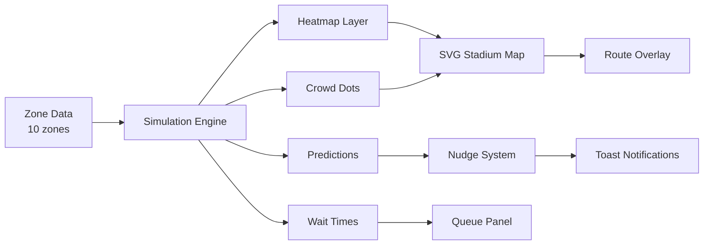

<](https://smartstadium-1064148922722.asia-south1.run.app)
[](https://github.com/dtnotdt/smart-crowd-detection-app)
[](LICENSE)

<br>


<br><br>

> A real-time, AI-simulated crowd management dashboard for smart stadiums. Built for the world's largest cricket stadium — Narendra Modi Stadium (132,000 capacity) — featuring digital twin visualization, predictive crowd analytics, smart routing, emergency response, and group tracking.

</div>

---

## 📋 Table of Contents

- [Overview](#-overview)
- [Key Features](#-key-features)
- [System Architecture](#-system-architecture)
- [Screens & Modules](#-screens--modules)
- [Tech Stack](#-tech-stack)
- [Getting Started](#-getting-started)
- [Deployment](#-deployment)
- [Project Structure](#-project-structure)
- [Demo Credentials](#-demo-credentials)

---

## 🌟 Overview

SmartStadium is a comprehensive crowd intelligence platform designed for large-scale venues. It combines **real-time crowd visualization**, **AI-powered predictions**, and **smart navigation** into a single, responsive dashboard — purpose-built for the IPL match experience at Narendra Modi Stadium.

The system simulates realistic crowd behavior across 10+ stadium zones, providing both **attendee-facing navigation** and **admin-facing analytics** through a unified interface.

### 🎯 Problem Statement

Managing 132,000+ spectators at the world's largest cricket stadium presents critical challenges:

| Challenge | SmartStadium Solution |
|---|---|
| Crowd bottlenecks at gates | 🗺️ Smart routing with 3 path options |
| Long food/washroom queues | ⏱️ Live wait times + least-busy recommendations |
| Emergency evacuation planning | 🚨 One-tap emergency mode with exit routing |
| Group coordination in massive venues | 👥 QR-based group tracking with meetup suggestions |
| Reactive crowd management | 📈 Predictive analytics with AI forecasting |

---

## ✨ Key Features

<table>
<tr>
<td width="50%">

### 🔮 Digital Twin Overlay
- Real-time heatmap visualization (green/yellow/red)
- Animated crowd dots simulating movement across zones
- Hover tooltips: crowd %, avg wait, state (Calm/Busy/High Risk)
- Toggle on/off for performance

</td>
<td width="50%">

### 🗺️ Smart Routing Engine
- **3 route options**: Fastest · Least Crowded · Balanced
- ETA (minutes) and distance display
- Animated route highlighting on SVG map
- Crowd-aware alternative suggestions

</td>
</tr>
<tr>
<td>

### 📈 Crowd Prediction Panel
- AI-simulated forecasts per zone
- "Gate B will increase by 20% in 10 mins"
- Live trend mini-graph with rolling data
- Auto-updating predictions every 10 seconds

</td>
<td>

### 💡 Smart Nudge System
- Context-aware push notifications
- "Gate D is less crowded — try entering there"
- "Food Court 3 has no queue right now"
- Triggered by real-time crowd imbalance detection

</td>
</tr>
<tr>
<td>

### 🍽️ Queue Enhancement
- Live wait times per counter (dynamic updates)
- Food order status tracking: ⏳ Preparing / ✅ Ready
- 🌟 Least-busy counter highlighted
- Full food menu with cart & checkout

</td>
<td>

### 👥 Group Tracking (QR-Based)
- Create group → generates mock QR code
- Join group via QR scan
- Each member shown as colored dot on map
- 📍 "Find My Group" → routes to nearest member
- 🤝 "Suggest Meetup" → lowest-density midpoint

</td>
</tr>
<tr>
<td>

### 🚨 Emergency Mode
- Floating SOS button (always visible)
- Highlights all 4 exits with pulsing markers
- Shows safest path from current position
- Active incident panel with details
- Exit distances + crowd state per gate

</td>
<td>

### 📊 Admin Analytics Dashboard
- Total crowd count, most crowded zone, avg wait
- Zone breakdown with capacity bars
- Staff management (roster, dispatch, broadcast)
- **What-If Simulation**: Close Gate C, restrict Gate A → see dynamic heatmap changes

</td>
</tr>
</table>

---

## 🏗️ System Architecture

```
┌──────────────────────────────────────────────────────────┐
│                    SmartStadium App                       │
├──────────────┬──────────────────┬────────────────────────┤
│  Landing     │   Main App       │   Admin Panel          │
│  • Scan QR   │   • Sidebar      │   • Dashboard          │
│  • Guest     │   • SVG Map      │   • Alerts             │
│  • Admin     │   • Overlays     │   • Staff Mgmt         │
│              │   • Predictions  │   • What-If Sim        │
│              │   • Emergency    │   • Analytics          │
├──────────────┴──────────────────┴────────────────────────┤
│                   Simulation Engine                       │
│  • Zone density fluctuation (4s interval)                │
│  • Digital twin dot animation (800ms)                    │
│  • Wait time jitter (8s interval)                        │
│  • Crowd prediction updates (10s interval)               │
│  • Smart nudge scheduler (18s + 35s intervals)           │
│  • Live clock + match countdown (1s)                     │
├──────────────────────────────────────────────────────────┤
│                   Deployment Layer                        │
│  Docker (nginx:alpine) → Google Cloud Run (asia-south1)  │
└──────────────────────────────────────────────────────────┘
```

### Data Flow



---

## 🖥️ Screens & Modules

### 1. Landing Screen
- Stadium branding with IPL 2025 theming
- Ticket scan (simulated with animation)
- Guest login option
- Admin access portal

### 2. Main App (Attendee View)

| Module | Tab | Description |
|---|---|---|
| **Navigate** | `nav` | Seat finder, 3 smart routes, avoid-crowds toggle, digital twin toggle |
| **Heatmap** | `heatmap` | All zone densities, surge simulation button |
| **Food** | `food` | Full menu (Main Course, Beverages, Snacks), cart system |
| **Waits** | `waits` | Real-time wait grid + food counter status with order tracking |
| **Groups** | `groups` | Create/join group, QR code, member map, meetup suggestion |

**Map Overlays:**
- 🟢🟡🔴 Heatmap ellipses per zone
- 🔵 Animated crowd dots (digital twin)
- ➡️ Route polylines with directional arrows
- 📍 Seat marker + user location dot
- 🚨 Emergency exit highlights (pulsing)
- 👥 Group member colored dots

### 3. Admin Panel

| Tab | Features |
|---|---|
| **Dashboard** | Crowd stats, zone breakdown, extended analytics, surge trigger, staff dispatch |
| **Alerts** | Active alerts with severity, alert history log |
| **Staff Mgmt** | Roster view, broadcast, open gate, send medical |
| **Analytics** | What-If simulation, crowd trend chart, gate volume chart |

---

## 🛠️ Tech Stack

| Layer | Technology | Purpose |
|---|---|---|
| **Structure** | HTML5 | Semantic markup, SVG stadium map |
| **Styling** | CSS3 | Custom properties, animations, glassmorphism |
| **Logic** | Vanilla JavaScript | Simulation engine, DOM rendering, state management |
| **Fonts** | Google Fonts | Space Grotesk (headings) + DM Sans (body) |
| **Graphics** | SVG | Stadium map, routes, heatmap, crowd dots |
| **Container** | Docker + nginx:alpine | Lightweight static file serving |
| **Hosting** | Google Cloud Run | Serverless, auto-scaling, Mumbai region |

### Why No Framework?

This project intentionally uses **zero dependencies** — no React, no build tools, no npm. The entire app is 3 files (~95KB total) that run instantly in any browser. This makes it:
- ⚡ **Instant load** — no bundle compilation
- 🔒 **Zero supply chain risk** — no node_modules
- 📦 **Tiny Docker image** — ~25MB with nginx:alpine
- 🌍 **Works offline** — just open the HTML file

---

## 🚀 Getting Started

### Run Locally (No Setup Required)

```bash
# Clone the repository
git clone https://github.com/dtnotdt/smart-crowd-detection-app.git
cd smart-crowd-detection-app

# Option 1: Just open in browser
open SmartStadium_Enhanced.html

# Option 2: Use a local server (for proper MIME types)
python3 -m http.server 8080
# Then visit http://localhost:8080
```

### Run with Docker

```bash
# Build the container
docker build -t smartstadium .

# Run on port 8080
docker run -p 8080:8080 smartstadium

# Visit http://localhost:8080
```

---

## ☁️ Deployment

### Google Cloud Run

```bash
# Authenticate
gcloud auth login

# Set project
gcloud config set project YOUR_PROJECT_ID

# Enable APIs
gcloud services enable run.googleapis.com artifactregistry.googleapis.com cloudbuild.googleapis.com

# Deploy (builds + deploys in one command)
gcloud run deploy smartstadium \
  --source . \
  --region asia-south1 \
  --allow-unauthenticated
```

**Current deployment:** [`asia-south1` (Mumbai)](https://smartstadium-1064148922722.asia-south1.run.app) — chosen for lowest latency to Ahmedabad.

---

## 📁 Project Structure

```
smart-crowd-detection-app/
├── SmartStadium_Enhanced.html   # 559 lines — HTML structure & SVG map
├── style_enhanced.css           # 315 lines — Complete design system
├── script_enhanced.js           # 918 lines — Simulation engine & logic
├── Dockerfile                   # nginx:alpine container
├── nginx.conf                   # Server config (port 8080, gzip, caching)
├── .dockerignore                # Docker build exclusions
├── .gitignore                   # Git exclusions
└── README.md                    # This file
```

---

## 🔑 Demo Credentials

| Role | Action |
|---|---|
| **Guest** | Click "Continue as Guest" on landing |
| **Ticket Holder** | Click "Scan Ticket" → tap scan area → "Enter Stadium" |
| **Admin** | Username: `admin` · Password: `admin123` |

---

## 📊 Simulation Parameters

| Parameter | Interval | Description |
|---|---|---|
| Zone density | 4 sec | ±2% random walk per zone (15–98% bounds) |
| Digital twin dots | 800 ms | Brownian motion within zone ellipses |
| Wait times | 8 sec | ±2 min jitter per queue (1–30 min bounds) |
| Crowd predictions | 10 sec | ±4% forecast variation |
| Smart nudges | 18 sec | Rotates through 6 contextual tips |
| Imbalance nudges | 35 sec | Triggers when high (>80%) and low (<45%) zones coexist |
| Clock & countdown | 1 sec | Live IST clock + countdown to 7:30 PM match time |

---

## 🏟️ Venue Context

| Detail | Value |
|---|---|
| **Stadium** | Narendra Modi Stadium (Motera) |
| **Location** | Ahmedabad, Gujarat, India |
| **Capacity** | ~132,000 (largest cricket stadium) |
| **Event** | IPL 2025 — Gujarat Titans vs Mumbai Indians |
| **Zones Modeled** | 10 (4 gates + 5 sections + food court) |
| **Simulated Crowd** | ~87,400 attendees (66% capacity) |

---

<div align="center">

### Built with ❤️ for smarter stadiums

**[Live Demo](https://smartstadium-1064148922722.asia-south1.run.app)** · **[GitHub](https://github.com/dtnotdt/smart-crowd-detection-app)**

</div>
]]>
